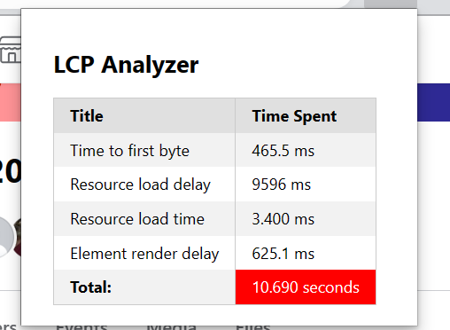
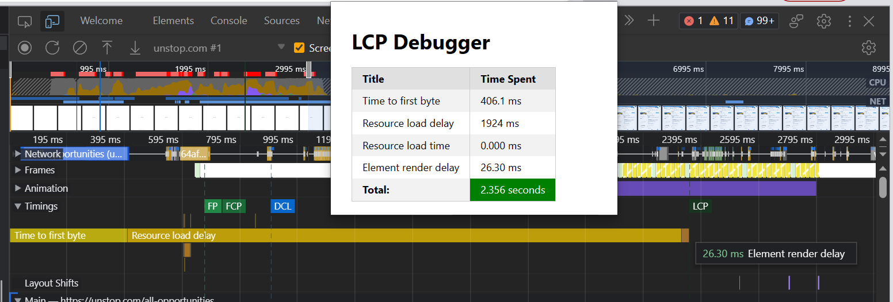

## LCP Analyzer

LCP Analyzer is an extension to monitor Largest Contentful Paint of webpage. It serve as diagnostic tools by breaking down the LCP metric into its key components, such as Time to First Byte, Resource Load Delay, Resource Load Time, and Element Render Delay. This breakdown allows users to identify the specific stages in the loading process that contribute the most to LCP and helps pinpoint potential performance bottlenecks.

LCP also known as Longest Containtful Paint is one of the important metric to optimise in order to get a fast webpage performance. Google recommends it is better to have LCP less that 2.5seconds. 

LCP being one of the harder metric to optimise because of these reasons:
- It is not easier to know where the browser is spending time to render the most important content. Is it in downloading? Is it in rendering? Is it because the Time To First Byte is slow? There are many questions like this.
- Optimising LCP does not come magically by optimising few things in the webpage. LCP is a indication of overall webpage performance and in order to get better LCP score the webpage needs to be improved in all areas.

Having said that, this extension is developed to help where the bottleneck occurs. A LCP time can be broken down into these 4 slots:
- Time To First Byte (TTFB)
- Resource Load Delay (RLD)
- Resource Load Time (RLT)
- Element Render Delay (ERD)

This extension gives you all these metrics so that you can put your effort in minimising the area where the bottleneck occurs instead of pulling your hair to find the LCP issue.

It will also render a small bar on top of webpage to show LCP information without having to click on the LCP icon.

Not only this, it will also add a mark at the performance tab of chrome console. 

You can see the above four breakdown of LCP in a performance tab which helps to even get more insights.

Any suggestions or PRs are appreciated.

Thank you!